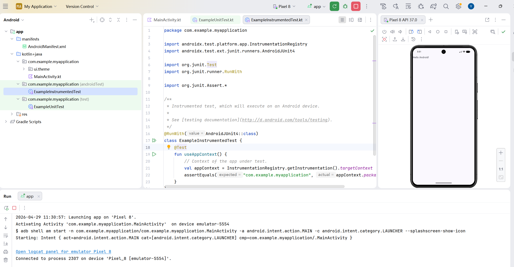
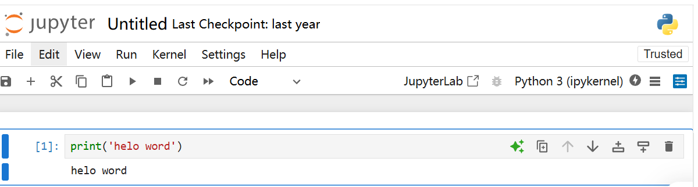

# 实验一：软件环境安装与配置报告

- **课程名称**：软件项目研发实践
- **实验名称**：安装课程所需软件
- **学生姓名**：熊依婷
- **学号**：11052023050
- **专业班级**：软工2班
- **指导教师**：林立

## 一、 实验内容

1. 安装Android Studio 4.1以上的版本，更好的支持LiteRT
2. 安装Jupyter Notebook和相关的Python环境，后续用于机器学习模型构建
3. 安装Visual Studio Code代码编辑器
4. 探索上述软件的使用，将安装过程以Markdown语法描述，并上传至Github(或Gitee)

## 二、 软件安装与运行验证

本人的开发环境为 Windows 11 系统。以下为各软件的具体配置与验证情况：

### 1. Android Studio 安装与首次运行

- **说明**：本次新安装了最新版的 Android Studio。新建了一个默认的 Android 项目，首次编译时自动下载并配置了 Gradle 相关的依赖库。
- **运行结果**：项目成功编译，并在模拟器/真机上成功运行。

> 

### 2. Anaconda (Jupyter Notebook) 环境说明

- **说明**：由于在两年前的课程/项目学习中已经下载并配置好了 Anaconda 环境，因此本次实验未做重复安装，直接调用了现有的 Python 运行环境。
- **验证情况**：经检查，本地 `conda` 环境运行正常，能正常启动 Jupyter Notebook 进行交互式代码编写。

> 

### 3. Visual Studio Code 编辑器配置

- **说明**：VS Code 同样为两年前已安装并作为日常使用的编辑器。本次实验中，确认已配置好 Python 和 Jupyter 相关的插件，可以直接在编辑器内运行 `.ipynb` 文件。

> 

## 三、 实验总结

本次实验主要目的是为了后续的移动端开发与机器学习模型构建做好准备。

1. **真实情况**：VS Code 和 Anaconda 作为我之前已经熟练使用的工具，无需重新安装，环境依然保持稳定可用。
2. **新学内容**：本次新接触了 Android Studio 的安装与配置。首次编译项目时，由于需要下载较多的 Gradle 依赖包，等待时间稍长，但最终无报错顺利跑通。